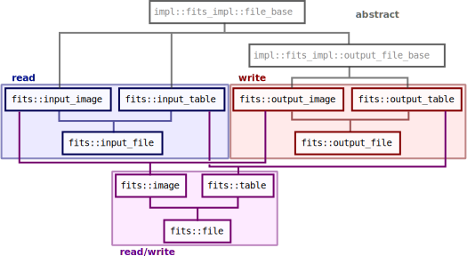

.. _FITS files:

Overview
========

Defined in header ``<vif/io/fits.hpp>``.

A few words on the FITS format
------------------------------

The FITS (Flexible Image Transport System) format is a general purpose file format originally developed for astrophysics data. In particular, FITS files can store images with integer or floating point pixel values, image cubes (with more than two dimensions), but also binary data tables with an arbitrary number of columns and rows. Using a meta-data system (keywords in a header), FITS files usually carry a number of important additional informations about their content. For example, for images files, this can be the mapping between image pixels and sky coordinates (WCS coordinates), or the physical unit of the pixel values.

A single file can contain any number of Header-Data Units (HDUs), which can be seen as independent "extensions" of the file. Each such extension can contain either image data or table data, and has its own header and keywords for storing meta-data. The first HDU of a FITS file has a special status and is called the "primary HDU"; it can only contain image data. For this reason FITS tables always have an empty primary HDU, and the table data located in the first extension.

Writing tabulated data in a binary FITS file is a space-efficient and fast way to store and read non-image data, vastly superior to using human-readable ASCII tables. FITS tables come in two fashions: row-oriented and column-oriented tables. In row-oriented tables, all the data about one row (e.g., about one galaxy in the table) is stored contiguously on disk. This means that it is very fast to retrieve all the information about a given object. In column-oriented tables however, a whole column is stored contiguously in memory. This means that it is very fast to read a given column for all the objects in the table. This distinction is analogous to the dilemma of choosing between a structure-of-array (column-oriented) or an array-of-structures (row-oriented).

Since vif vectors are also contiguous in memory and are used to store data from a given column, the column-oriented format is the most efficient, and is therefore the default format in vif. An additional benefit of this format is that it allows storing columns of different lengths, which is particularly useful to carry meta-data that would be hard to store in FITS keywords. The column-oriented format is not well known, but most softwares and libraries do support it. Topcat_ does, and in IDL column-oriented FITS files are supported naturally by the mrdfits_ and mwrfits_ procedures. But since row-oriented files are nevertheless very common, vif is capable of reading and writing in both formats.

.. _Topcat: http://www.star.bris.ac.uk/~mbt/topcat/
.. _mrdfits: https://www.harrisgeospatial.com/docs/mrdfits.html
.. _mwrfits: https://www.harrisgeospatial.com/docs/mwrfits.html

The FITS implementation in vif
------------------------------

Because FITS files can have a complex structure, vif offers *three* different interfaces to interact with them, which offer different levels of abstraction, capabilities, and ease of use.

The lowest level interface is the raw C interface of the CFITSIO_ library. This interface allows the finest control over the FITS file structure, however it is more cumbersome to use and more error prone. Unless you need to do something very specific that the other interfaces cannot achieve, it is not recommended to use the CFITSIO interface directly. If you do need to use it, please refer to the official CFITSIO documentation.

The second interface already has a significantly higher abstraction level. It is available through the classes ``fits::input_table``,  ``fits::output_table``, ``fits::table``, ``fits::input_image``, ``fits::output_image``, and ``fits::image``. This is an object-oriented interface, where an instance of one of the classes above represents an open FITS file, through which you can navigate to read and/or write data. This is versatile enough to allow you to create multiple table or image extensions, modify data inside the file (i.e., one pixel, or one cell in a table), and edit individual header keywords.

The last and simplest interface is provided through the free functions ``fits::read_table()``, ``fits::write_table()``, ``fits::update_table()``, ``fits::read_image()``, ``fits::write_image()``, and ``fits::update_image()``. These allow you to read/write/update data from a single extension in a FITS file, all with a single function call. They are most convenient when dealing with simple FITS files, however they are less powerful than the object-oriented interface described above.

The object-oriented interface is implemented directly on top of the CFITSIO C API, and the simple free-function interface is implemented on top of the object-oriented interface. These interfaces are not based on the official CFITSIO C++ wrapper, CCFITS_, mostly because its level of abstraction is too high such that it was not possible to implement all the required features with it. This official wrapper could have simply been adopted as the default FITS implementation in vif, however its design choices conflicted too blatantly with the vif "mindset" (different choice of container types, class hierarchy too deep, and notion of HDU too central).

.. _CFITSIO: https://heasarc.gsfc.nasa.gov/fitsio/
.. _CCFITS: https://heasarc.gsfc.nasa.gov/fitsio/CCfits/

General information on the FITS classes
---------------------------------------

The class hierarchy is roughly modeled around the ``std::iostream`` interface:

A file can be opened directly by providing the file name in the constructor, or using the ``open()`` member function. Memory and other resources are freed automatically in the destructor of the object, however it is possible to close the file early if needed using the ``close()`` member function. When the file is open, classes ``fits::input_image``, ``fits::output_image``, and ``fits::image`` will automatically go to the first extension of the file containing image data, likewise with ``fits::input_table``, ``fits::output_table``, and ``fits::table`` and table data.

Any invalid operation will raise an exception of the type ``fits::exception`` (with ``fits::exception::what()`` providing a text message describing the error). It is safe to recover from exceptions raised when attempting invalid data read operations (incorrect image format, unknown table columns, ...). However, write operations are not exception-safe; if they happen, the only safe course of action is to close the file and consider its content as corrupted.

If an instance of any of these classes is shared by multiple execution threads, all operations (even simple queries about the state of the file) must be protected by a mutex lock. In contrast, multiple instances can be used in multiple threads without locking as long as:

- each instance is used by a single thread only,
- all instances are pointing to different files, or instances pointing to the same file are all performing read operations only.
